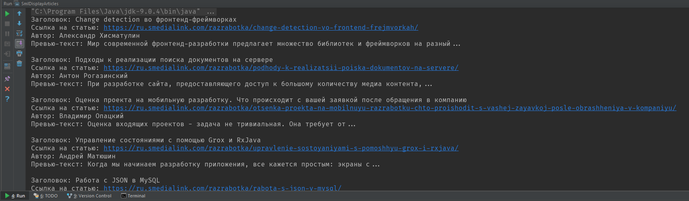
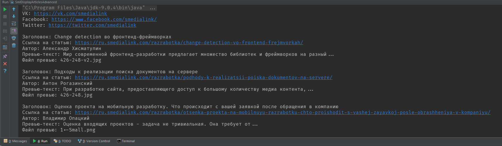

# Retrofit 2 + Jspoon = парсинг html на лету

Всем привет! Приходилось ли вам сталкиваться с задачами загрузки каких-либо данных с сайтов, у которых отсутствует API? 
В подобных случаях многие разработчики предпочитают использовать различные вспомогательные библиотеки для обработки html. 
К примеру, одним из наиболее популярных решений для парсинга html является библиотека [Jsoup](jsoup.org), содержащая довольно
мощные инструменты для поиска и извлечения всех необходимых вам данных. Тем не менее, при использовании подобных библиотек 
разработчику все равно потребуется потратить определенное время на "разбор" содержимого сайта и работу с полученными структурами данных. 

Сегодня мы рассмотрим [Jspoon](https://github.com/DroidsOnRoids/jspoon) - небольшую, но довольно полезную библиотеку, которая значительно облегчает этот процесс,
а также попробуем что-нибудь распарсить.

В примере с парсингом подразумевается наличие RxJava 2 и Retrofit 2, которые де-факто являются стандартными инструментами в
арсенале Android-разработчика.

## Установка

Для установки добавьте необходимые зависимости в файл `app/build.gradle` вашего проекта.

#### Основная библиотека:
~~~ groovy
dependencies {
    implementation 'pl.droidsonroids:jspoon:1.3.0'
}
~~~

#### Конвертер для Retrofit 2:
~~~ groovy
dependencies {
    implementation 'pl.droidsonroids.retrofit2:converter-jspoon:1.3.0'
}
~~~

## Как это работает?

Работа Jspoon основана на использовании аннотации ***@Selector*** с параметрами, на основе которых осуществляется парсинг html для получения
POJO объектов. А благодаря тому, что для внутреннего парсинга html применяется все тот же Jsoup, для использования с аннотацией ***Selector***
вам [доступен](https://jsoup.org/cookbook/extracting-data/selector-syntax) полный синтаксис селекторов этой библиотеки, что позволит извлекать данные из html-кода
практически любой сложности.

## @Selector

Аннотация может быть применена к полям следующих типов (или соответствующих им примитивов):
* String
* Boolean
* Integer
* Long
* Float
* Double
* Date
* BigDecimal
* Element (тип данных из Jsoup)
* Любой класс с конструктором по умолчанию
* List и его подтипы

#### Параметры аннотации Selector

##### value
Основной параметр, значение которого будет использоваться в качестве критерия для извлечения данных из html. Поддерживаются синтаксис селекторов из Jsoup.

##### attr
Параметр, определяющий извлекаемый из html-тега атрибут. По умолчанию используется значение `textContent`, так же доступны
несколько предопределенных вариантов: `html` (или `innerHtml`) и `outerHtml`. Кроме того, можно указать любой другой атрибут тега,
который необходимо извлечь (например, для извлечения ссылки из тега `` необходимо использовать параметр `attr="src"`)

##### regex
Позволяет указать регулярное выражение, которое будет применено к данным, извлекаемым селектором из параметра ***value***.

##### defValue
Если используемый вами селектор не обнаружит подходящих данных, то поле класса будет инициализированно значением по умолчанию, указанным здесь.

## @Format

Дополнительная аннотация для парсинга даты в поле типа Date, используется совместно с аннотацией `@Selector`

#### Параметры аннотации Format

##### value
Определяет формат даты для парсинга, например:
~~~ java
@Format(value = "HH:mm:ss dd.MM.yyyy")
@Selector(value = "#date")
Date date;
~~~

##### languageTag
Locale используется для парсинга типов Float, Double и Date. Вы можете указать свое значение, например:
~~~ java
@Format(languageTag = "ru")
@Selector(value = "div > p > span")
Double pi;
~~~

## Давайте что-нибудь распарсим!

Перейдем от теории к практике и для примера распарсим раздел [Разработка](https://ru.smedialink.com/blog/razrabotka/) из SML-блога.

Для начала, определим статический вспомогательный метод для создания инстанса Retrofit, который будет использоваться для выполнения запросов к нашему блогу:
~~~ java
  static Retrofit createRetrofitInstance() {

    return new Retrofit.Builder()
        .baseUrl(BASE_URL)
        .client(customOkHttpClient())
        .addCallAdapterFactory(RxJava2CallAdapterFactory.create())
        .addConverterFactory(JspoonConverterFactory.create())
        .build();
  }
~~~

Для использования Jspoon достаточно подключить соответствующий конвертер с помощью метода `addConverterFactory`, после чего
в дело вступит аннотация `@Selector`, благодаря которой будут конструироваться объявленные нами классы.

В качестве базового примера рассмотрим получение статей из блога в виде списка объектов класса `SmlArticlePreview`, который содержит поля с
названием статьи, ссылкой на статью, именем автора и небольшим превью-текстом. Для этого заглянем в исходники страницы с материалами блога и определим необходимые нам селекторы:

~~~ html
...

	
	

		
Александр Хисматулин

			
<a class="title" href="https://ru.smedialink.com/razrabotka/change-detection-vo-frontend-frejmvorkah/">Change detection во фронтенд-фреймворках</a>

		
Мир современной фронтенд-разработки предлагает множество библиотек и фреймворков на разный...

		
1 марта
<a href="https://ru.smedialink.com/blog/razrabotka/" class="button-tag tag">Разработка</a>
	

	
	

		
Антон Рогазинский

			
<a class="title" href="https://ru.smedialink.com/razrabotka/podhody-k-realizatsii-poiska-dokumentov-na-servere/">Подходы к реализации поиска документов на сервере</a>

		
При разработке сайта, предоставляющего доступ к большому количеству медиа контента,...

		
1 марта
<a href="https://ru.smedialink.com/blog/razrabotka/" class="button-tag tag">Разработка</a>
	

...
~~~

Каждая новость в блоге заключена в тег `div` с классом `news__item`, используем это для создания класса `BlogPage`, в котором будет содержаться список статей:
~~~ java
public class BlogPage {

  @Selector("div.news__item")
  public List<SmlArticlePreview> articles;
}
~~~

Аналогичным образом используем аннотации для получения данных об отдельно взятой статье. Название на статью использует
тег с классом `title`, теги с автором и превью имеют классы `author` и `preview` соответственно, а для получения ссылки используем параметр `attr`, описанный выше.
В итоге объявление класса `SmlArticlePreview` имеет следующий вид:

~~~ java
public class SmlArticlePreview {

  @Selector(value = "a.title")
  public String title;

  @Selector(value = "a.title", attr = "href")
  public String link;

  @Selector(value = "p.author")
  public String author;

  @Selector(value = "p.preview")
  public String preview;
}
~~~

Далее объявим интерфейс `BlogLoader`, который содержит методы для загрузки статей из базового и продвинутого примеров.

~~~ java
public interface BlogLoader {

  @GET("/blog/razrabotka/")
  Single<BlogPage> loadBlogPage();

  @GET("/blog/razrabotka/")
  Single<BlogPageAdvanced> loadBlogPageAdvanced();
}
~~~

Для проверки результатов используем простую программу на Java:

~~~ java
  public static void main(String[] args) {

    RetrofitHelper
        .createRetrofitInstance()
        .create(BlogLoader.class)
        .loadBlogPage()
        .subscribe(
            blogPage ->
                blogPage.articles.forEach(SmlDisplayArticles::prettyPrintArticle),
            throwable ->
                System.out.println("Ошибка загрузки: " + throwable.getMessage()));
  }
~~~

И распечатаем результаты в консоли:

~~~ java
  private static void prettyPrintArticle(SmlArticlePreview article) {
    System.out.println("Заголовок: " + article.title);
    System.out.println("Ссылка на статью: " + article.link);
    System.out.println("Автор: " + article.author);
    System.out.println("Превью-текст: " + article.preview);
    System.out.println("");
  }
~~~

#### Дополнительный пример

В следующем примере рассмотрим дополнительные возможности селекторов, позволяющие более точно настроить парсинг необходимых нам данных. Предположим, что
кроме списка статей со страницы нам необходимо получить ссылки на некоторые страницы компании в социальных сетях, а класс статьи так же должен содержать поле со ссылкой на картинку-превью.

Еще раз заглянем в исходники страницы:
~~~ html

  <ul class="social__list">
    <li class="social-list__item"></li>
    <li class="social-list__item"></li>
    <li class="social-list__item"></li>
    <li class="social-list__item"></li>
  </ul>

~~~

Для получения ссылок нам необходимо извлечь тег `a` с уникальным идентификатором, соответствующим конкретной соц. сети. В итоге класс, представляющий страницу блога будет иметь вид:

~~~ java
public class BlogPageAdvanced {

  @Selector(value = "a[id=id_vk_social]", attr = "href")
  public String vkLink;

  @Selector(value = "a[id=id_fb_social]", attr = "href")
  public String facebookLink;

  @Selector(value = "a[id=id_tw_social]", attr = "href")
  public String twitterLink;

  @Selector("div.news__item")
  public List<SmlArticlePreviewAdvanced> articles;
}
~~~

Для извлечения картинки на превью статьи воспользуемся синтаксисом селекторов, позводяющим искать теги в определенной последовательности. Т.к. поиск будет осуществляться внутри
тега `div` имеющего класс `news__item`, то нам остается лишь найти тег `img` внутри тега `a` и получить его аттрибут `scr`.
Обновленная версия класса, представляющего статью:
~~~ java
public class SmlArticlePreviewAdvanced {

  @Selector(value = "a.title")
  public String title;

  @Selector(value = "a.title", attr = "href")
  public String link;

  @Selector(value = ".author")
  public String author;

  @Selector(value = "p.preview")
  public String preview;

  @Selector(value = "a > img", attr = "src", defValue = "")
  public String previewImage;
}
~~~
Также обратите внимание на параметр `defValue`, определяющий значение по умолчанию для поля previewImage в случаях неудачного парсинга (когда статья не содержит картинку-превью).

Обновим основной блок тестовой программы:
~~~ java
  public static void main(String[] args) {

    RetrofitHelper
        .createRetrofitInstance()
        .create(BlogLoader.class)
        .loadBlogPageAdvanced()
        .subscribe(
            blogPage -> {
              System.out.println("VK: " + blogPage.vkLink);
              System.out.println("Facebook: " + blogPage.facebookLink);
              System.out.println("Twitter: " + blogPage.twitterLink);
              System.out.println("");
              blogPage.articles.forEach(SmlDisplayArticlesAdvanced::prettyPrintArticle);
            },
            throwable ->
                System.out.println("Ошибка загрузки: " + throwable.getMessage()));
  }

  private static void prettyPrintArticle(SmlArticlePreviewAdvanced article) {
    System.out.println("Заголовок: " + article.title);
    System.out.println("Ссылка на статью: " + article.link);
    System.out.println("Автор: " + article.author);
    System.out.println("Превью-текст: " + article.preview);
    System.out.println("Превью-картинка: " + article.previewImage);
    System.out.println("");
  }
~~~

И проверим результат:

